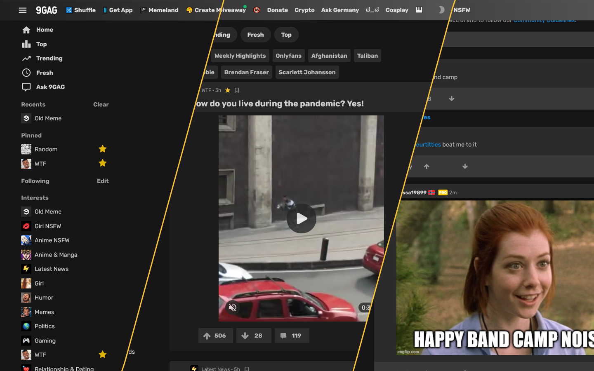
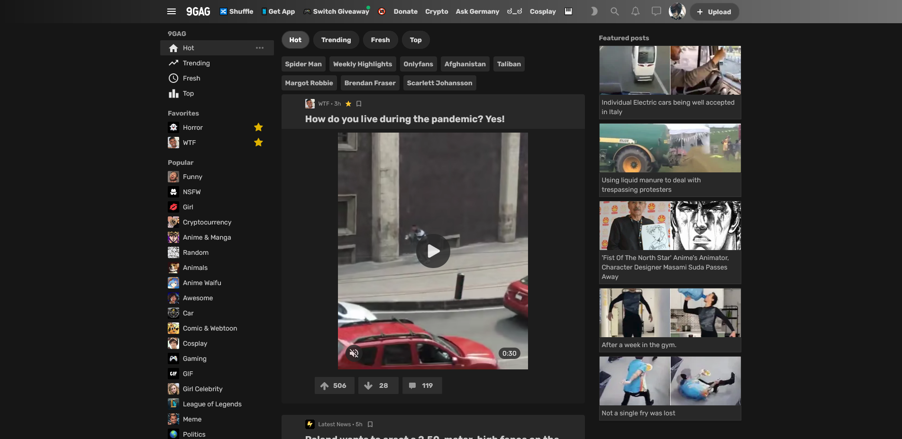
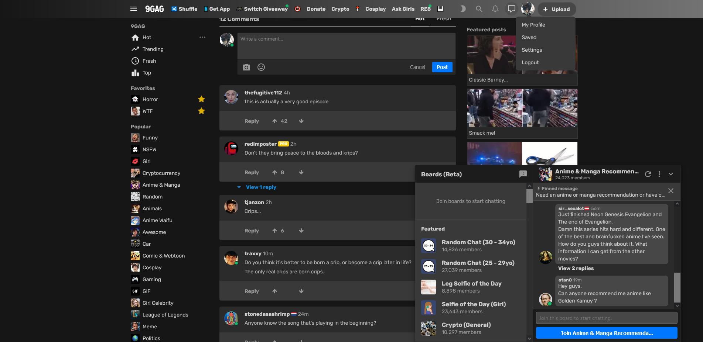

# 9gag Gradient Dark - Revamped

 This is an improved dark theme created for 9gag. In addition to shifting the theme to dark, the layout of the entire website has been redesigned.  
 
 *To display as intended, disable 9gag's inbuilt dark theme.*

 > Inspired by [9gag Gradient Black Mode](https://uso.kkx.one/style/164082).

## Install and setup
In order to use this theme or any other userstyles you will need to install a browser extension. I recommend using the Stylus extension.

### Browser extension:
Get the Stylus addon for:

### Install this theme:

  >Installs directly from this repository.
  >This is only available using Stylus (see the [documentation](https://github.com/openstyles/stylus/wiki/Usercss)).

## Screenshots

## License
[GNU GPLv3](LICENSE)
